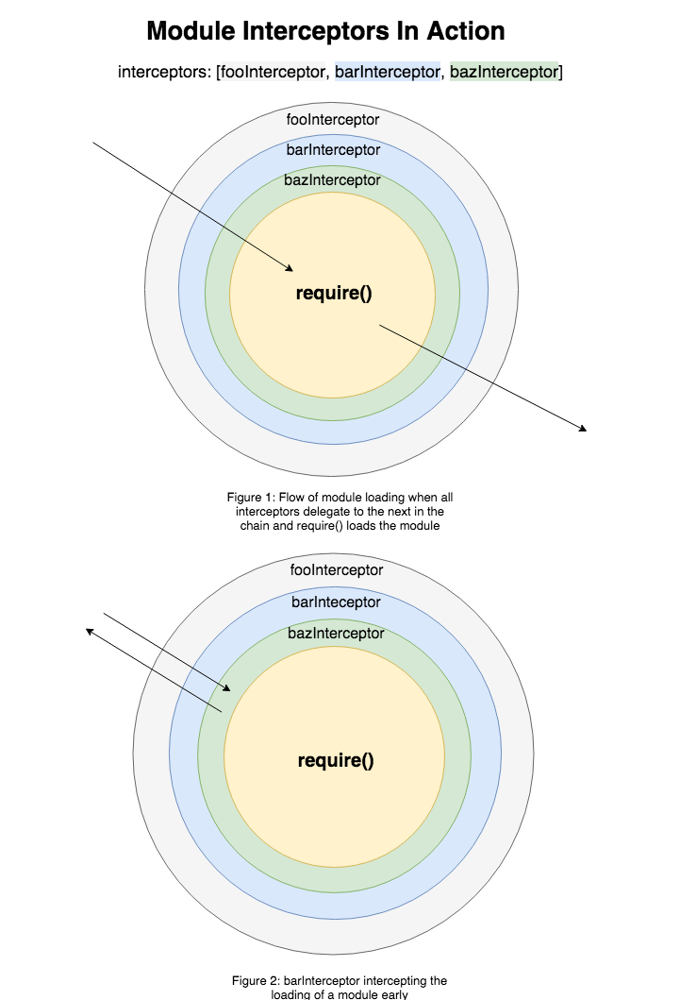

## Description

`bagel-module-loader` contains all module loading logic for bagel.

## Installation

`npm install --save bagel-module-loader`

## Usage

```javascript
import createLoader from 'bagel-module-loader';

// initialize loader
const load = createLoader({resolvers: [testResolver]});

// If desired, assemble some context data which will be accessible at multiple points during the module load process
const context = {foo: 'foo'};

// load some modules!
const loaded = load('foo', __dirname, {});
```

## Configuration Options

```javascript
{
  // list of module resolvers for custom resolving
  resolvers?: Array<Resolver>,
  // list of methods to perform an action before default require() is called
  interceptors?: Array<Interceptor>,
  // list of methods to convert source code
  sourceCodeTransformers?: Array<Transformer>,
  // method to wrap the module being served
  wrapModule?: source: string => result: string,
  // method to customize cache key generation within bagel
  generateModuleCacheKey?: GenerateModuleCacheKey,
}
```

## Request Context

A number of the hooks in the module loader provide access to a context object which can be passed in with each call to the modoule loader. The core bagel module supplies a [JobHandlerRequest](../bagel/src/types.js) as context.

({
jobRequest,
parentBatchRequest,
jobResponseMetadata,
batchResponseMetadata
}: JobHandlerRequest)

## Module Resolvers

```javascript
type Resolver = (
  dependencyID: string,
  from: string,
  requestContext: {}
) => string | null;
```

Bagel's resolve method loops through the resolvers provided, falling back on default node resolution if none
of the provided resolvers are able to resolve the module.

## Module Interceptors



```javascript
type Interceptor = ({
  moduleID: string,
  requestContext: {[string]: any},
  next: string => any
}) => any;
```

Interceptors allow developers to tap into the module loading process. In the process of loading a module, bagel will sequentially step through the interceptors supplied before the actual 'require' function is invoked.
These methods have access to a specific job's `moduleID, requestContext` and `next`. Interceptors can modify the requestContext supplied and can invoke `next()` to delegate to the next interceptor in the chain. Interceptors can also short-circuit the module loading process by returning early. These two flows are illustrated in the diagram above.

## Source Code Transformers

```javascript
type Transformer = ({path: string, source: string}) => {
  errors: Array<string>,
  transformedSource: string
};
```

Provide a source code transformer if you would like to transform the initial module source code.

## Wrap Module

Pass in your own wrapper function if you would like to customize how a module is wrapped before it is loaded.

## Generate Module Cache Key

```javascript
type GenerateModuleCacheKey = ({
  moduleID: string,
  requestContext: Object,
  pathToSourceFile: string
}) => string | null;

// ie)
({moduleID}) => `${moduleID}_${pretendCacheBuster}`;
```

`bagel-module-loader` caches compiled source code. If a cache key isn't found, the source code will be loaded from disk in the course of loading the module. `generateModuleCacheKey` is a method to generate these cache keys.
